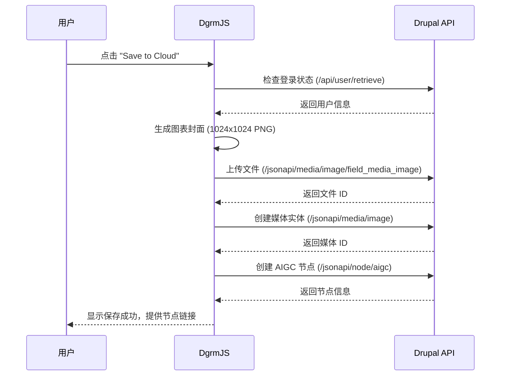

# DgrmJS 云端保存功能 - 项目说明

本文档说明了为 DgrmJS 流程图编辑器添加的云端保存功能及其技术实现。

## ✨ 新增功能概述

### 云端保存功能
- 🎨 **自动封面生成** - 从图表生成 1024x1024 PNG 封面
- ☁️ **云端存储** - 将图表保存到 Drupal AIGC 内容管理系统
- 🔐 **无缝认证** - 使用 Drupal 原生 Session Cookie 认证
- 📱 **响应式界面** - 支持各种设备的保存操作

### 功能对比

| 功能 | 原版 DgrmJS | 增强版 DgrmJS |
|------|-------------|---------------|
| 本地编辑 | ✅ | ✅ |
| PNG 导出 | ✅ | ✅ (重命名为 Download) |
| 云端保存 | ❌ | ✅ **新增** |
| 用户认证 | ❌ | ✅ **新增** |
| 封面生成 | ❌ | ✅ **新增** |
| Drupal 集成 | ❌ | ✅ **新增** |

## 🏗️ 技术架构

### 开发环境架构
```
浏览器 (localhost:3001)
    ↓ HTTP 请求
开发代理服务器 (simple-dev-server.js)
    ↓ 静态文件服务 (src/)
    ↓ API 代理转发 + Cookie 处理
Drupal 服务器 (目标生产域名)
    ↓ JSON:API 响应
    ↓ Session Cookie 管理
```

### 生产环境架构
```
用户浏览器
    ↓ HTTPS 请求
Drupal 服务器 (当前应用同域名)
    ├── /dgrm/ → DgrmJS 静态文件
    ├── /api/ → Drupal 自定义 API
    ├── /jsonapi/ → Drupal JSON:API
    └── /session/ → CSRF Token 端点
```

## 🔐 认证系统

### Session Cookie 认证机制
- **开发环境**: 通过代理服务器转发 Cookie 到 Drupal
- **生产环境**: 同域直接传递 Session Cookie
- **安全性**: CSRF Token 保护所有写操作
- **用户体验**: 无需额外登录，使用现有 Drupal 账户

### 认证流程
1. 用户在 Drupal 系统登录
2. 浏览器保存 Session Cookie
3. DgrmJS 自动检测登录状态
4. 启用云端保存功能

## 📁 项目结构

### 新增文件
```
src/
├── infrastructure/
│   ├── drupal-api.js        # Drupal API 客户端 ⭐ 新增
│   └── diagram-cover.js     # 封面图片生成 ⭐ 新增
├── ui/
│   └── menu.js              # 主菜单组件 ✏️ 修改
├── index.dev.html           # 开发版本页面 ✏️ 修改
└── save-test.html           # 保存功能测试套件 ⭐ 新增

根目录/
├── simple-dev-server.js    # 简化开发服务器 ⭐ 新增
├── dev-server.js           # 完整开发服务器 ⭐ 新增
├── rollup.dev.config.js    # 开发构建配置 ⭐ 新增
├── DEPLOYMENT.md           # 部署指南 ⭐ 新增
├── DEV-SETUP.md            # 开发环境指南 ⭐ 新增
├── USAGE.md                # 使用指南 ⭐ 新增
└── PROJECT-INFO.md         # 项目说明 ⭐ 新增
```

### 核心组件说明

#### `src/infrastructure/drupal-api.js`
Drupal API 客户端，负责：
- 用户认证状态检查
- CSRF Token 管理
- 文件上传到 Drupal 媒体系统
- 媒体实体创建
- AIGC 节点创建
- 完整的保存工作流程

#### `src/infrastructure/diagram-cover.js`
封面图片生成器，功能：
- 从 SVG/Canvas 生成 PNG 封面
- 自动调整为 1024x1024 尺寸
- 处理空图表的默认封面
- 支持开发测试和生产环境

#### `src/ui/menu.js`
主菜单组件，修改：
- 添加 "Save to Cloud" 按钮
- 原 "Save diagram image" 重命名为 "Download diagram image"
- 集成用户登录状态检查
- 添加保存进度提示

## 🚀 开发环境

### 快速开始
```bash
# 安装依赖
npm install

# 启动开发服务器
npm run dev:simple

# 访问应用
http://localhost:3001/index.dev.html

# 访问测试套件
http://localhost:3001/save-test.html
```

### 开发脚本
```json
{
  "dev:simple": "node simple-dev-server.js",     // 简化开发服务器（推荐）
  "dev": "node dev-server.js",                   // 完整开发服务器
  "dev:build": "rollup -c rollup.dev.config.js", // 开发构建
  "dev:watch": "rollup -c rollup.dev.config.js -w", // 监听模式
  "build": "rollup -c rollup.config.js",         // 生产构建
  "preview": "npx http-server dist -p 8080 -c-1 --cors -o" // 预览
}
```

### 代理服务器特性
- ✅ **API 代理** - 转发所有 Drupal API 请求
- ✅ **Cookie 转发** - 自动处理认证 Cookie
- ✅ **CORS 支持** - 解决跨域问题
- ✅ **错误处理** - 详细的错误日志
- ✅ **热重载** - 支持开发时的实时更新

## 🧪 测试工具

### 保存功能测试套件 (`save-test.html`)
完整的分步测试工具，包含：

1. **🔐 Authentication Check** - 验证用户登录状态
2. **🎨 Generate Test Diagram** - 生成测试图表
3. **📊 Generate Cover Image** - 测试封面生成
4. **📤 Test File Upload** - 测试文件上传
5. **🖼️ Test Media Creation** - 测试媒体创建
6. **📝 Test Node Creation** - 测试节点创建
7. **🎉 Complete Save Workflow** - 测试完整流程

### 测试价值
- **开发调试** - 逐步验证每个 API 环节
- **问题排查** - 精确定位保存流程中的问题
- **功能验证** - 确认新功能正常工作
- **API 测试** - 验证与 Drupal 的集成

## 🎯 部署策略

### 环境对比

| 方面 | 开发环境 | 生产环境 |
|------|----------|----------|
| **域名** | localhost:3001 | 当前应用同域名 |
| **API调用** | 跨域 + 代理 | 同域直接调用 |
| **认证方式** | Cookie 代理转发 | Cookie 直接传递 |
| **代理需求** | ✅ 需要 | ❌ 不需要 |
| **性能** | 开发优化 | 生产优化 |

### 生产环境优势
- ✅ **无跨域问题** - 同域名下直接 API 调用
- ✅ **无代理开销** - 减少网络延迟和服务器负载
- ✅ **简化架构** - 移除代理服务器依赖
- ✅ **原生认证** - 直接使用 Drupal Session Cookie
- ✅ **更好性能** - 减少中间层处理

### 部署流程
```bash
# 1. 构建生产版本
npm run build

# 2. 部署到 Drupal 服务器
cp dist/* /path/to/drupal/web/dgrm/

# 3. 访问生产环境
https://your-domain.com/dgrm
```

详细部署指南请参考：[DEPLOYMENT.md](DEPLOYMENT.md)

## 📊 API 流程

### 保存到云端完整流程


### API 端点说明
- `/api/user/retrieve` - 获取当前用户信息
- `/session/token` - 获取 CSRF Token
- `/jsonapi/media/image/field_media_image` - 文件上传
- `/jsonapi/media/image` - 媒体实体创建
- `/jsonapi/node/aigc` - AIGC 节点创建

## 🔧 配置说明

### Drupal 集成要求
确保 Drupal 系统配置了以下内容类型和字段：

1. **AIGC 内容类型** (`node--aigc`)
   - `title`: 标题字段
   - `content_type`: 内容类型字段（值为 "diagram"）
   - `field_cover`: 封面图片字段（引用 media--image）

2. **媒体类型** (`media--image`)
   - `name`: 媒体名称
   - `field_media_image`: 图片文件字段

### Drupal Session Cookie 配置

为了支持跨域认证和 JavaScript 访问，需要配置 Drupal 的 session cookie 参数：

```yaml
# sites/default/services.yml
parameters:
  session.storage.options:
    cookie_httponly: false       # 允许 JS 访问 cookie
    cookie_secure: false         # 非 HTTPS 环境下允许发送 cookie
    cookie_samesite: 'None'      # 允许跨域发送 cookie
```

**配置说明**：
- `cookie_httponly: false` - DgrmJS 需要通过 JavaScript 检测登录状态
- `cookie_secure: false` - 支持开发环境的 HTTP 协议
- `cookie_samesite: 'None'` - 确保开发环境的跨域代理能够携带认证信息

**生产环境建议**：
- 生产环境可设置 `cookie_secure: true` 并使用 HTTPS
- 生产环境可调整 `cookie_samesite: 'Lax'` 增强安全性

### 环境变量
开发环境自动检测，生产环境可通过以下方式配置：
```javascript
// 环境检测
this.isDevelopment = window.location.hostname === 'localhost' || window.location.hostname === '127.0.0.1';
this.baseURL = this.isDevelopment ? '' : window.location.origin;
```

## 📝 使用说明

### 用户操作流程
1. **登录认证** - 在 Drupal 系统登录
2. **创建图表** - 在 DgrmJS 编辑器中绘制流程图
3. **保存到云端** - 点击菜单 → "Save to Cloud"
4. **输入标题** - 为图表命名
5. **等待完成** - 系统自动保存并返回链接

### 本地下载
点击菜单 → "Download diagram image" 可下载 PNG 格式文件

## 🆘 故障排除

### 常见问题
1. **保存失败** - 检查 Drupal 登录状态
2. **认证错误** - 验证 Session Cookie 和 CSRF Token
3. **文件上传失败** - 确认文件格式和大小限制
4. **网络问题** - 检查与 Drupal 服务器的连接

### 调试工具
- 使用 `save-test.html` 逐步测试各个环节
- 查看浏览器开发者工具的 Network 标签
- 检查开发服务器的代理日志

## 📚 相关文档

- [CONFIGURATION.md](CONFIGURATION.md) - 环境配置指南
- [DEPLOYMENT.md](DEPLOYMENT.md) - 详细部署指南
- [DEV-SETUP.md](DEV-SETUP.md) - 开发环境设置
- [USAGE.md](USAGE.md) - 用户使用指南
- [doc/SAVE-API.md](doc/SAVE-API.md) - Drupal API 接口文档

## 🎉 项目成果

### 技术成就
- ✅ 成功集成 Drupal JSON:API
- ✅ 实现 Session Cookie 认证
- ✅ 解决跨域和代理问题
- ✅ 创建完整的测试套件
- ✅ 建立开发和生产环境

### 功能特性
- ✅ 无缝的用户体验
- ✅ 自动封面生成
- ✅ 完整的错误处理
- ✅ 响应式界面设计
- ✅ 详细的调试工具

### 部署优势
- ✅ 开发环境：完整的代理和调试支持
- ✅ 生产环境：简化架构，原生性能
- ✅ 自动化：CI/CD 支持和部署脚本
- ✅ 监控：错误监控和性能追踪

---

**开发团队**: DgrmJS Team  
**项目版本**: v1.0.0  
**最后更新**: 2025年6月 